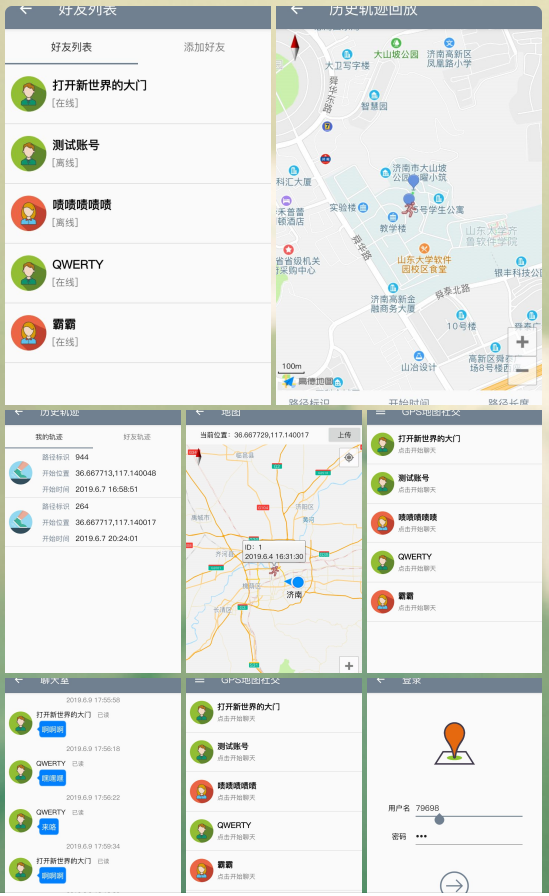

# GPS地图社交系统 Version 2019.a.190610

### 基本说明
* 使用Kotlin语言开发
* SDK API 28
* 高德地图API
https://lbs.amap.com

### 界面一览

### 基本功能

#### 用户信息
* 用户注册登录功能
* 用户信息维护功能

#### 地图定位
* 基本定位
* 方向采集
* 用户位置上传
* 历史位置共享

#### 轨迹记录
* 记录轨迹以及距离
* 轨迹列表
* 轨迹查询回放

#### 交友聊天
* 用户列表
* 用户聊天
* 大聊天室聊天

#### 其他功能
* 问题反馈